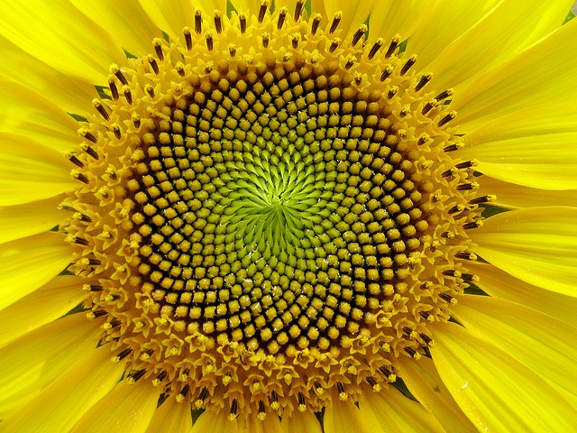
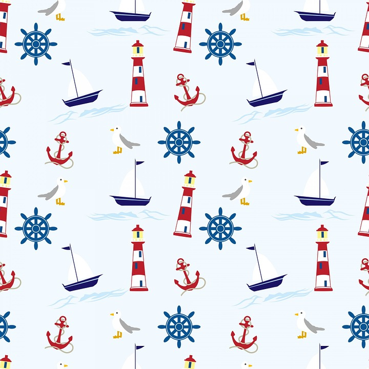
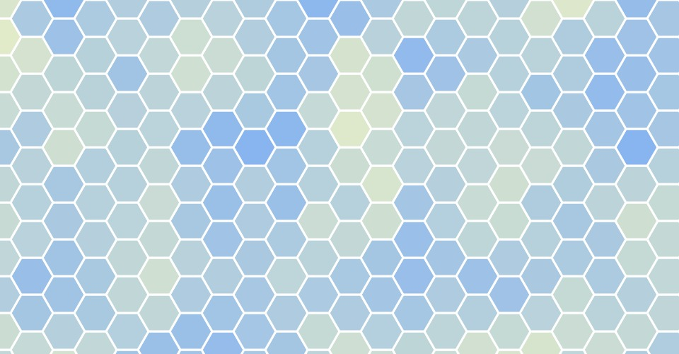
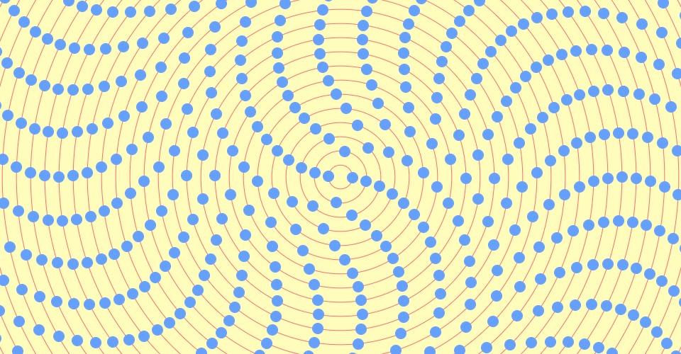
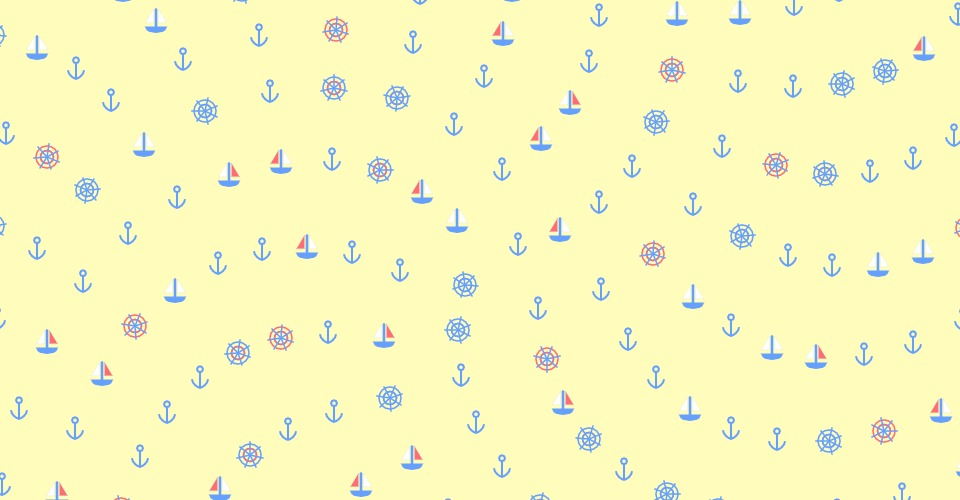

17.2.MDDN342 PS3

####22 SEPT 17
I am beginning work on my landscape today

#### 22 SEPT 17
 The radialArrange() method is the heart of this pattern. The pattern's radial arrangement is based off fibbonacci spirals, specifically those found in  the seed arrangement of sunflowers 

 I think the most visually impressive part of the design is the spiral arms made by the radial arrangement. To emphasize this, I chose to include a large amount of negative space in the design. I chose the nautical theme for the glyphs after making these decisions because the 'wavy' effect that the arrangement creates. I was also inspired by wallpapers like this 
 I think the swirling repetition here is a refreshing take on th simple diamond tessellation I have seen on a lot of pale, ocean themed wallpapers.

radialArrange() can be used to create a range of different patterns depending on the 'seed' - the number of nodes in the first ring of the pattern. At lower seed numbers, the fibbonacci spiral arms are bold, and effective. This effect decreases with higher seeds and, after a seed of around 6, the method will generate an arrangement that looks more like a series of rings than the churning eddies seen here.

At a seed of one, the pattern looks quite disordered.  

A seed of two creates a very bold, and interesting arrangement which I really like, and want to re-use in my landscape generator. 

I almost settled on this 3-seeded pattern, but felt that a seed of 4 played a little more nicely with the square canvas. 

The color scheme and drawing style of the glyphs is simplistic and a little childish, which I think gives a tenor of [seafaring whimsy](https://www.youtube.com/watch?v=cmt-MlMuPzg) I imagine this pattern being used as a wallpaper for a bathroom at a nice waterfront café or a child's room in a modern oriental bay home.
