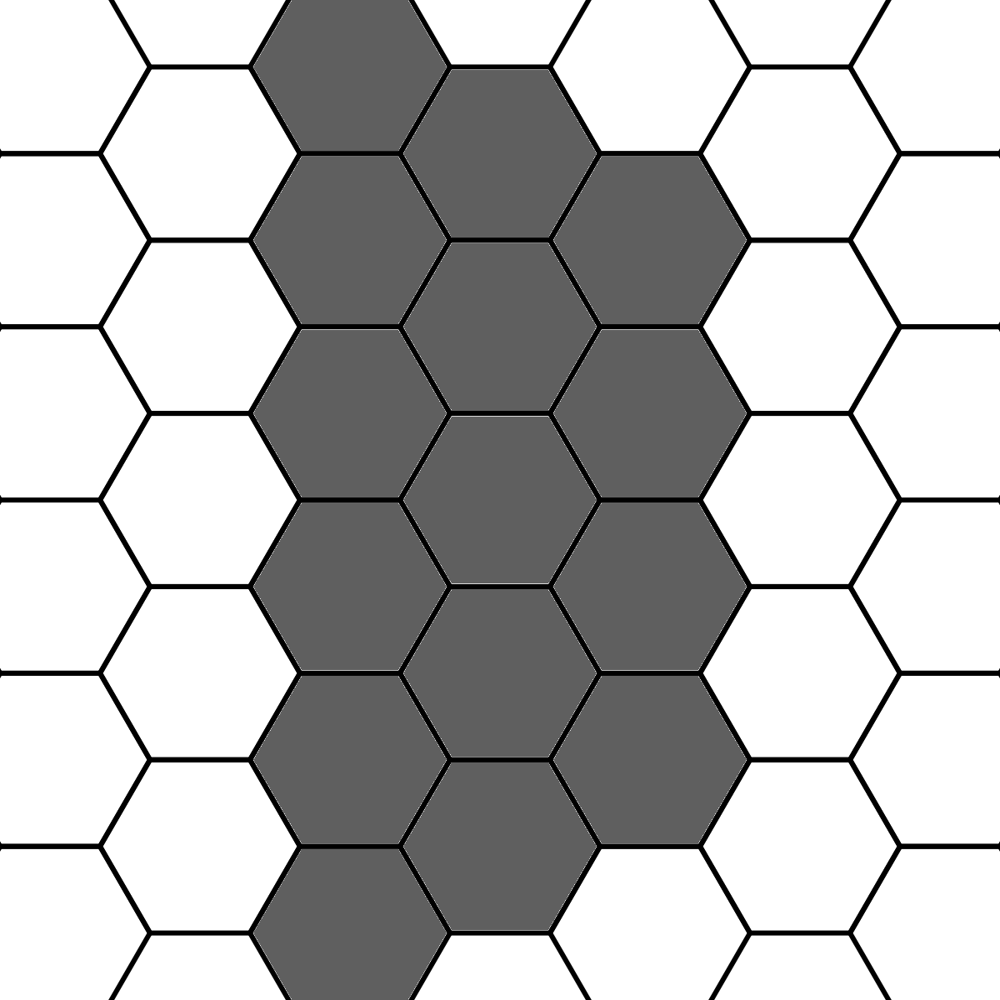

## MDDN 242 2022 Assignment 2

## Hexagons 2 - Electric Boogaloo

Today was do or die for my hexagon idea, I tried making all the letters in the alphabet and keeping track of what squares were used. This resulted in far too many data points being required, however when I tried to switch to upper case lettering i found 15 data points that can be used to represent all of the numbers and letters! This process took much longer than expected however I have implemented all letters now.

## Hexagons - The maybe not bestagons

I posted my design in the feedback channel and got some awesome interpolation ideas, however came up with to a problem realising many of the characters and numbers I would like represented won't work with the small layout I had, like b not having space for a hexagon between the holes which meant it looked like a D. I looked at increasing the size however still faced problems with 8 looking the same as a b. I spent a long time in a photo editor trying different layouts with all the numbers and letters but didn't find a solution.

## Hexagons - The Bestagons
Today I created a hexagonal design for my font, the idea came from [CGP Gray's "Hexagons are the Bestagons"](https://www.youtube.com/watch?v=thOifuHs6eY) video. I'm not sure about how it will work with interpolation and how some letters like e could be improved, so this is definitely not the final idea.

The three parameters per letter:
  * `visible` : 10 length array of numbers denoting the visibility of each of the hexagons
