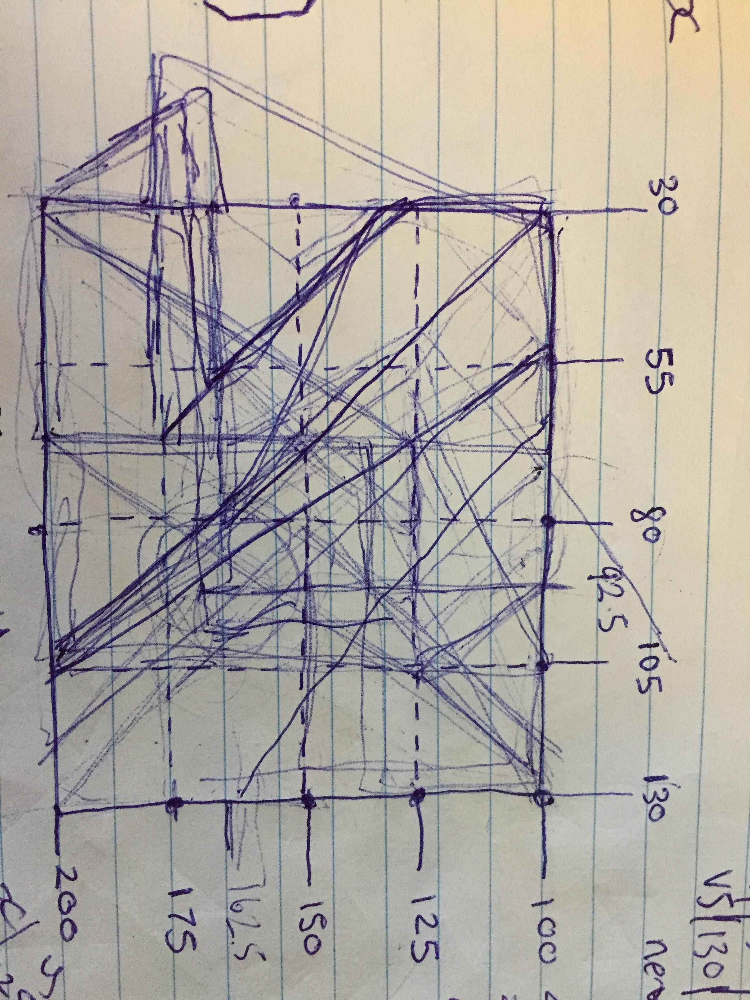

## PS2 MDDN 242 2018

;

### IDEA:

I have named my alphabet 'TRONBLOCK', it follows a robotic/block like theme. Some letters are intended to look slightly incomplete, as the unfinished section is replaced by a small ellipse. continuing the outline of the letter around the ellipse the letter should become clear.

TRONBLOCK uses 12 parameters, these are divided up between 5 vertices and and x,y for an ellipse.

..* V1 : v1x, v1y : Vertex for inital point of the shape

..* V2 : v2x, v2y : Vertex connecting the 1st and 3rd vertex

..* V3 : v3x, v3y : Vertex connecting the 2nd and 4th vertex

..* V4 : v4x, v4y : Vertex connecting the 3rd and 5th vertex

..* V5 : v5x, v5y : Vertex connecting the 4th vertex and the anchor point

..* cirX : ellipse X value

..* cirY : ellipse Y value

### PROCESS:

My design orignially began with 8 parameters and only 4 ajustable vertices, this had a number of my letters looking to similar and some letters near impossible to illustrate such as 'G' and 'W'. As a solution to this problem I chose to add a 5th adjustable vertex to allow more letter transforming, and a small ellipse to add an extra dimension to the design. This resulted in my tron style alphabet. (a drawing ive uploaded demonstrates this evolvement) 

