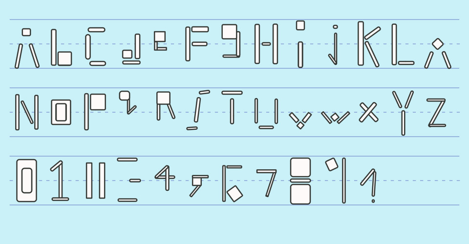

## MDDN 242 Project 1: Time-based Media  

**Part 1:**
For my part 1 sketch I played around with the idea of a solar eclipse, with 24 different eclipse states (phases) to represent hours. To represent minutes and seconds I have red and white orbiting moons respectively. I also added some numbers like an analog clock however these go to 60 to help with visual clarity. I like the idea of vibrant colours on a dark background to draw the eye.

**Part 2:**
The Maeda clock I have chosen to recreate is clock-04. I was able to successfully recreate the shearing effect after a level of great difficulty. I decided to use less squares to represent a number as it was easier to conceptualise and implement. I experimented with having the time animate in many directions but decided on two up and two down to fill the screen with past numbers as I find this visually intriguing.

**Part 3:**
The original clock I designed has a spaceship shooting game theme.
At the top right, several hearts are displayed using the 12-hour time format with yellow hearts in PM. When each hour ends, a new heart appears and expands into place. In the bottom left, there is an overheating bar that changes color from green to lime, then yellow/orange, and finally red throughout the minute. During the last third of the minute, the screen flashes using millis to simulate the idea of "warning overheating occurring." The green spaceship fires bullets every second and half a second, with bars on the bottom right indicating the time remaining until the next shot. The green spaceship also does not fire when zero minutes have elapsed (no red spaceships on screen) or at the end of a minute when cooling down from overheating.
The number of enemy (red) spaceships corresponds to the current minute, with a new spaceship entering from the top center and flying into the front of the formation just before the minute changes. On the hour change, all the red spaceships disperse into an arc shape offscreen, signifying the beginning of a new hour. The background continuously scrolls to create movement in the scene. Lastly, the spaceships move in a lemniscate (infinity) path, symbolizing the infinite nature of time.

**Part 4:**
For the alarm, I decided to implement a countdown with text that fades to red as a big boss approaches, while all the little enemy spaceships disperse just before its arrival. When the alarm is triggered, the boss shoots a large beam. Once the alarm is over, the boss will slowly move back up the screen until it is no longer visible, and the little enemy spaceships will fly back into formation. I've avoided destroying/exploding spaceships, as with the p5.js framework, this can cause serious framerate issues and have a negative visual impact.

**References**
OpenGameArt. (2013, June 17). Space ship construction kit [Example spaceships and component sprites]. OpenGameArt. <u>https://opengameart.org/content/space-ship-construction-kit</u>

Deep Fold. (2023, March 18). Pixel Planet Generator [Online program for creating planet images]. <u>https://deep-fold.itch.io/pixel-planet-generator</u>