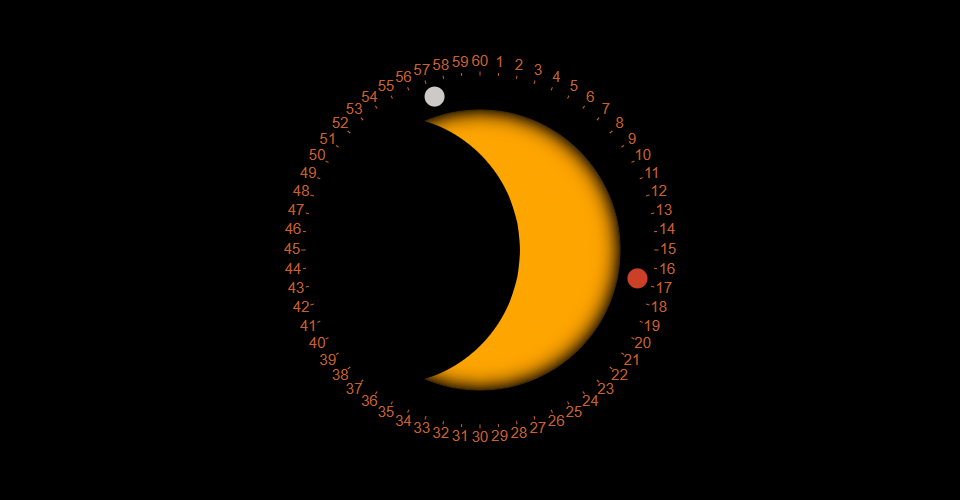

## MDDN 242 Project 1: Time-based Media  

### Galactic Odyssey Clock
**Daniel Gibbens**

**Part 1:**
For my part 1 sketch I played around with the idea of a solar eclipse, with 24 different eclipse states (phases) to represent hours. To represent minutes and seconds I have red and white orbiting moons respectively. I also added some numbers like an analog clock however these go to 60 to help with visual clarity. I like the idea of vibrant colours on a dark background to draw the eye.

**Part 2:**
The Maeda clock I have chosen to recreate is clock-04. I was able to successfully recreate the shearing effect after a level of great difficulty. I decided to use less squares to represent a number as it was easier to conceptualise and implement. I experimented with having the time animate in many directions but decided on two up and two down to fill the screen with past numbers as I find this visually intriguing.

**Part 3:**
I changed my idea as I did not feel it was interesting enough. I did most of my design ideation by testing ideas in p5js as I am more of a programmer than a designer and struggle to come up with ideas. I was inspired by another student with a clock in the style of Pac-Man as well as the pong example shown in class. I thought a 2D arcade-style game is an amazing idea since I am someone who is passionate about games and love the arcade style. I believe that the various mechanics games offer could provide a captivating and unique way to represent the concept of time.
The next problem was deciding on the type of game. I considered brick breaker and snake, but found that brick breaker's physics were too complex, while snake was visually too simple and not intriguing enough. After conducting some research, I stumbled upon spaceship shooters and remembered that I had made one before, which inspired me to use it as a base (the ship modelling kit used in that project is referenced below).
The next challenge was determining the game mechanics to represent time. I considered using seconds as a score or the number of bullets fired, minutes as a level or score, and hours as difficulty, health, or waves. However, I realised that using score could lead to framerate issues due to frequent ship explosions, and the concept of levels/waves/difficulty should not reset upon 60 or 24.

My original clock design is as follows:
At the top left, several hearts are displayed using the 12-hour time format with yellow hearts in PM. When each hour ends, a new heart appears and expands into place. In the bottom left, there is an overheating bar that changes color from green to lime, then yellow/orange, and finally red throughout the minute. During the last third of the minute, the screen flashes using millis to simulate the idea of 'warning overheating occurring.' The green spaceship fires bullets every second and half a second, with bars on the bottom right indicating the time remaining until the next shot and the overheating bar to indicate how many consecutive shots have been fired over the current minute. The green spaceship also does not fire when zero minutes have elapsed (no red spaceships on screen) or at the end of a minute when cooling down from the overheating mechanic. The number of enemy (red) spaceships corresponds to the current minute, with a new spaceship entering from the top center and flying into the front of the formation just before the minute changes. On the hour change, all the red spaceships disperse into an arc shape offscreen, signifying the beginning of a new hour. The background continuously scrolls to create movement in the scene. Lastly, the spaceships move in a lemniscate (infinity) path, symbolizing the infinite nature of time.

**Part 4:**
For the alarm, I decided to implement a countdown with text that fades to red to represent danger as a big boss approaches, while all the little enemy spaceships disperse just before its arrival. When the alarm is triggered, the boss shoots a large beam. Once the alarm is over, the boss will slowly move back up the screen until it is no longer visible, and the little enemy spaceships will fly back into formation. I've avoided destroying/exploding spaceships, as with the p5.js framework, this can cause serious framerate issues and have a negative visual impact.

**Part 5:**
My design was essentially completed already. However, I added one final feature: the speed of the enemy red ships changes depending on the time of day. From 10 pm to 6 am, they move slower to represent people sleeping, and from 6 am to 10 pm, they move faster to represent people being up and moving around.

**References**
OpenGameArt. (2013, June 17). Space ship construction kit [Example spaceships and component sprites]. OpenGameArt. <u>https://opengameart.org/content/space-ship-construction-kit</u>

Deep Fold. (2023, March 18). Pixel Planet Generator [Online program for creating planet images]. <u>https://deep-fold.itch.io/pixel-planet-generator</u>